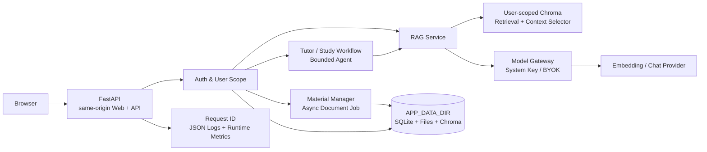

# AI Learning Companion「知行」

> 一个以个人学习资料为知识边界、强调 Evidence / Citation、可评测 RAG 与可恢复学习流程的 AI 学习应用。

## 项目简介

知行（Study Material Assistant）不是通用聊天壳，也不把"检索到来源"直接等同于"回答可信"。
它把资料摄取、检索、上下文构造、模型调用、证据引用、Tutor 学习流程和本地工程能力组织在
一个可检查的系统中，目标是帮助用户从自己的资料里检索、理解、练习和持续学习。

当前版本是**本地单实例、工程边界较完整的 AI 应用原型**。代码、自动化测试和历史受控实验
已有证据；Docker 镜像构建、云端部署、真实 Provider 兼容矩阵、并发负载与生产安全仍未验收。
核心工程基线为 `study-material-v2-stage6-final`；发布准备 checkpoint 为 `study-material-v2-release-1.0`。

## 项目解决什么问题

普通资料问答常见三个问题：

- 资料分散且篇幅长，模型无法稳定定位真正相关的内容；
- 回答看起来合理，但来源只是候选列表，无法确认具体主张由哪段资料支持；
- 优化容易变成堆叠 BM25、Reranker、Agent 等组件，却没有固定基线证明复杂度值得。

知行采用 Evidence First 与 Evaluation Driven 的方式处理这些问题：检索结果先形成请求内
Evidence Map，模型声明的 Citation ID 再由服务端校验；检索优化则通过固定 Dataset、单变量
实验、逐案例回归、延迟和调用成本共同决定是否进入正式链路。

## Features

| 能力 | 当前实现 | 证据边界 |
| --- | --- | --- |
| RAG Knowledge Base | TXT、Markdown、DOCX、带文字层 PDF 与受控公开网页；暂存、解析、费用估算、增量 Chroma 索引 | 扫描 PDF/OCR、登录网页和批量爬取不支持 |
| Evidence & Citation | 稳定资料/Chunk 身份、请求内 Evidence Map、服务端 Citation ID 校验与 metadata 回填 | 有效 ID 不自动证明 claim-level 支持度 |
| Retrieval Evaluation | 固定 Retrieval Dataset、Trace、Recall@K、MRR、nDCG、Context Precision 与失败分类 | 当前 Dataset 较小，历史结果绑定特定 commit 与索引快照 |
| Tutor Agent Workflow | 单 Tutor LangGraph 路由 QA、解释、练习、总结和学习计划；资料问答复用正式 RAG | 不是 Multi-Agent，真实模型 Tutor 质量矩阵未验收 |
| Async Document Processing | `202 + job_id`、SQLite Job、单进程串行 Worker、失败落库和重启恢复 | 不是分布式队列，不支持多实例抢占 |
| Model Gateway & BYOK | RAG / Agent / Tutor 共用 Provider 路由；系统配置或每用户加密 BYOK | 无自动 Failover、价格路由、KMS/HSM 与多凭据 |
| User Isolation | scrypt 密码、可撤销服务端 Session、用户独立资料目录与 Chroma、业务所有权校验 | 自动化覆盖不等于公开多租户渗透验收 |
| Observability | Request ID、结构化安全日志、请求历史与单进程聚合指标 | 指标重启清零，无外部 Collector、SLO 和告警 |
| Docker Readiness | 非 root Dockerfile、单服务 Compose、Healthcheck 与 named volume | 当前 Release 尚未执行 Docker build/up 与云部署 |

正式问答链路不是 BM25 + Dense，也没有接入 Cross-Encoder Reranker。BM25 + RRF、Reranker
和 Structure-aware Chunking 是已完成的隔离实验；只有通过当前验收门槛的
`EvidenceScoreContextSelector` 接入正式 RAG。详细数据与取舍见
[RAG Evaluation Report](docs/RAG_EVALUATION_REPORT.md)。

## Architecture



正式 RAG 数据流：

```text
Query Embedding
  -> 当前用户 Chroma Dense Top 10
  -> relevance >= 0.25
  -> 0.8 vector score + 0.2 keyword coverage
  -> Top 3 Seed + 同源相邻扩展
  -> EvidenceScoreContextSelector
  -> Evidence Map
  -> LCEL Prompt
  -> Model Gateway / ChatModel
  -> Citation ID 校验
  -> Answer + sources + validated citations
```

完整系统图、上传链路、Agent / LangGraph 状态流、持久化与失败边界见
[Final Architecture](docs/FINAL_ARCHITECTURE.md)。持续变化的事实以
[Project Status](docs/PROJECT_STATUS.md) 为准。

## Tech Stack

| 分类 | 技术 |
| --- | --- |
| Frontend | Native HTML、CSS、JavaScript |
| Backend | Python 3.12、FastAPI、Uvicorn、Pydantic |
| AI | LangChain、LCEL、LangGraph、OpenAI-compatible Provider Adapter、Crawl4AI |
| Retrieval | Chroma、Dense Retrieval、关键词覆盖率重排、Context Selector |
| Storage | SQLite、per-user filesystem、per-user Chroma、Index Manifest |
| Infrastructure | Dockerfile、Docker Compose、named volume、Healthcheck |
| Quality | `unittest`、Retrieval Evaluation、结构化日志、Runtime Metrics |

## Quick Start

### 1. 环境准备

- Python 3.12（与 Dockerfile 基线一致）；
- PowerShell 或等价终端；
- 仅运行页面、注册登录和 `/health` 时不需要模型 Key；
- 索引、RAG、Agent 或 Tutor 会调用外部模型，运行前需确认 Provider、数据发送和费用。

### 2. 安装依赖

```powershell
python -m venv .venv
.\.venv\Scripts\Activate.ps1
python -m pip install -r requirements.txt
```

### 3. 配置环境变量

```powershell
Copy-Item .env.example .env
```

在本地 `.env` 中按需要配置：

- `BAILIAN_API_KEY`、`BAILIAN_BASE_URL`：Embedding 与默认 Qwen 配置；
- `MODEL_API_KEY`、`MODEL_BASE_URL`：Model Gateway 的系统 ChatModel 配置；
- `MODEL_CREDENTIAL_ENCRYPTION_KEY`：保存用户 BYOK 时必需的 Fernet 主密钥；
- `APP_DATA_DIR`：SQLite、资料、Chroma、Job 和日志的统一持久化目录。

生成 Fernet Key：

```powershell
python -c "from cryptography.fernet import Fernet; print(Fernet.generate_key().decode())"
```

只把生成结果写入本地 `.env` 或部署平台的 Secret，不要提交、粘贴到 Issue 或输出到日志。
完整变量和默认值见 [.env.example](.env.example)。

### 4. 启动服务

```powershell
python -m app.server
```

访问：

- Web：`http://127.0.0.1:8000/`
- Health：`http://127.0.0.1:8000/health`
- OpenAPI：`http://127.0.0.1:8000/docs`

启动和 `/health` 不调用 Embedding、ChatModel 或 Reranker。健康检查成功只证明进程可响应，
不代表模型配置、索引、真实问答或生产依赖已经可用。

## Docker Start

仓库提供单服务 Compose，应用、前端和 Document Worker 运行在同一个进程边界内，持久状态写入
`zhixing-data` named volume：

```powershell
Copy-Item .env.example .env
docker compose up --build
```

后续启动：

```powershell
docker compose up
```

默认访问 `http://127.0.0.1:8000/`。停止但保留数据：

```powershell
docker compose down
```

不要在没有备份时删除 `zhixing-data` volume，也不要让多个应用副本同时写入同一份
SQLite / Chroma 数据。当前 Release 环境没有 Docker CLI，因此以上是仓库定义的启动方式，
不是本轮已执行通过的容器验收。部署前请先完成镜像构建、Health、持久化重启与备份恢复验证。

## Project Structure

```text
study-material-assistant/
|-- app/                 FastAPI、RAG、摄取、Agent、Workflow、Gateway 与评测逻辑
|   \-- model_gateway/   Provider 路由、Adapter 与 BYOK 密文存储
|-- web/                 同源原生前端与静态资源
|-- tests/               Fake/Mock、临时 SQLite 与契约回归测试
|-- evaluation/          固定数据集与版本化评测输入
|-- docs/                架构、状态、决策、Demo、面试与阶段报告
|-- Dockerfile           非 root 单应用镜像定义
|-- docker-compose.yml   单服务、Healthcheck 与 named volume
|-- .env.example         无密钥的配置模板
\-- requirements.txt     锁定的 Python 运行依赖
```

本地运行生成的 `.env`、数据库、上传资料、Chroma、日志、缓存和评测结果不属于源码，
不得提交到公开仓库。

## Documentation

### 开始开发与理解项目

- [Project Context](docs/PROJECT_CONTEXT.md)：开发、Review 与交接的最小上下文；
- [Project Status](docs/PROJECT_STATUS.md)：当前阶段、Git checkpoint、证据层级和未验证项；
- [Development Guide](docs/DEVELOPMENT_GUIDE.md)：本地开发、验证、数据和 Git 工作流。

### 架构与工程决策

- [Final Architecture](docs/FINAL_ARCHITECTURE.md)：Stage 6 冻结展示架构；
- [Architecture](docs/ARCHITECTURE.md)：持续维护的真实架构；
- [Decisions](docs/DECISIONS.md)：由代码和实验支撑的关键取舍。
- [Deployment Guide](docs/DEPLOYMENT_GUIDE.md)：单实例部署策略、平台适配、验收与回滚边界。

### Evaluation、Demo 与面试

- [Evaluation Guide](docs/EVALUATION.md)：Dataset、指标、失败分类与费用门槛；
- [RAG Evaluation Report](docs/RAG_EVALUATION_REPORT.md)：Stage 2～3 受控实验汇总；
- [5-minute Demo Guide](docs/DEMO_GUIDE.md)：演示脚本、费用边界和故障恢复；
- [Interview Guide](docs/INTERVIEW_GUIDE.md)：项目介绍、技术追问与证据边界；
- [Stage 6 Completion Report](docs/stage6-completion-report.md)：最终工程基线与验证记录。
- [Release 1.0 Completion Report](docs/release-1.0-completion-report.md)：GitHub、安全、部署与最终 Review。

## Validation

`study-material-v2-stage6-final` 与本轮 Release 1.0 全量自动化均为 `434/434`；本轮耗时
`29.440s`、退出码为 `0`。测试主要使用 Fake / Mock、临时 SQLite 和本地文件，证明接口、
权限、状态、回退和安全契约；它们不证明
真实 Provider 质量、并发容量、公开安全或用户学习效果。

零付费回归命令：

```powershell
.\.venv\Scripts\python.exe -B -m unittest discover -s tests -p 'test_*.py' -q
.\.venv\Scripts\python.exe -m pip check
node --check web\static\app.js
```

真实 Retrieval / RAG 评测有单独费用确认参数。不要为了验证 README 直接运行付费评测；
运行条件、调用数量和报告口径见 [Evaluation Guide](docs/EVALUATION.md)。

## Roadmap

### Completed

- Stage 0～6：架构审计、Evidence / Citation、Retrieval Evaluation、受控 RAG 优化、Tutor、
  持久化与用户隔离、异步任务、可观测性、Model Gateway、Demo 与作品化收口；
- 本地单实例正式主链、自动化回归和历史受控评测；
- Dockerfile / Compose / Healthcheck / volume 等部署定义。

### Release 1.0 - Completed

- GitHub README 与文档入口收敛；
- Git 历史、ignore 规则、环境模板与 BYOK 公开安全审查；
- 部署策略、五分钟 Demo 与 Release 完成报告；
- 完成 Release 报告与 `study-material-v2-release-1.0` 本地 Tag；
- 未执行 push、真实云部署或真实模型调用。

### Future - 需要独立验收

- Docker build/up、容器持久化重启和备份恢复；
- 单实例云端部署、HTTPS、Secret 管理和公开安全检查；
- 当前认证版本的真实 Provider / RAG / Tutor 兼容与质量矩阵；
- 并发、负载、长时间运行和明确 SLO；
- 扩大 Retrieval / Answer / Faithfulness / claim-level Citation 基准集。

Multi-Agent、MCP、GraphRAG、Redis、外部队列和多实例不会为了技术展示自动加入；只有真实
需求、现有瓶颈和评测证据同时成立时才重新评估。

## Public Release Boundary

- 本仓库整理完成不等于已经 push、公开部署或通过生产验收；
- 公开前必须再次检查 Git diff、历史敏感信息、演示资料版权、部署 Secret 和数据备份；
- 当前仓库尚未选择 `LICENSE`。在维护者明确许可证之前，公开可见不等于获得开源使用授权；
- 安全问题不应通过公开 Issue 附带 Key、`.env`、真实日志或用户资料。
